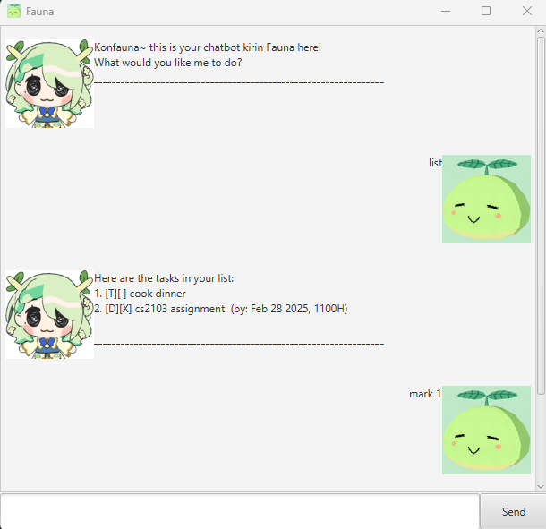

# Fauna User Guide



Your favourite kirin chatbot is here! Manage your time and keep up to date with schedules with Fauna, your personal chatbot assistant

## Adding ToDos: `todo`

Adds a ToDo task to the list

Example: `todo prepare dinner`

```
Got it. I've added the task:
	[T][ ] prepare dinner 
Now, you have 1 tasks in your list.
```

## Adding Deadlines: `deadline`

Adds a Deadline task to the list

Example: `deadline CS6969 assignment 420 /by 2023-03-12 2359`

```
Got it. I've added the task:
	[D][ ] CS6969 assignment 420  (by: Mar 12 2023, 2359H)
Now, you have 2 tasks in your list.
```

## Adding Events: `event`

Adds an Event task to the list

Example: `event Jon's Birthday at Maccas /from 2024-12-12 1300 /to 2024-12-12 1800`

```
Got it. I've added the task:
	[E][ ] Jon's Birthday at Maccas  (from: Dec 12 2024, 1300H to: Dec 12 2024, 1800H)
Now, you have 3 tasks in your list.
```

## Listing all saved tasks: `list`

Lists all the tasks saved

Example: `list`

```
Here are the tasks in your list:
1. [T][ ] prepare dinner 
2. [D][ ] CS6969 assignment 420  (by: Mar 12 2023, 2359H)
3. [E][ ] Jon's Birthday at Maccas  (from: Dec 12 2024, 1300H to: Dec 12 2024, 1800H)
```

## Marking tasks as done: `mark`

Marks a task in the list as done

Example: `mark 1`

```
Nice! I've marked this task as done:
	[T][X] prepare dinner 
```

## Marking tasks as undone: `unmark`

Marks a task in the list as undone

Example: `unmark 1`

```
Okay, I've marked this task as undone:
	[T][ ] prepare dinner
```

## Removing tasks: `delete`

Adds a deadline task to the list

Example: `delete 1`

```
Alright, I've removed the task:
	[T][ ] prepare dinner 
Now, you have 2 tasks in your list.
```

## Searching for tasks: `find`

Adds a deadline task to the list

Example: `find Birthday`

```
Here, I found some matching tasks in your list:
2. [E][ ] Jon's Birthday at Maccas  (from: Dec 12 2024, 1300H to: Dec 12 2024, 1800H)
```

## Tagging tasks: `tag`

Adds a #tag to a task

Example: `tag 2 important`

```
Alright, I've added a tag for the task:
	[D][ ] CS6969 assignment 420 {#important} (by: Mar 12 2023, 2359H)
```

## Exiting from the program: `bye`

Adds a deadline task to the list

Example: `bye`

```
Faunwell! Hope to see you again soon!
```